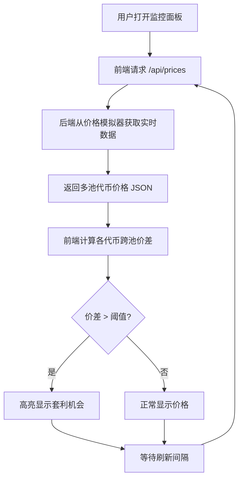

## 1. 产品概述
Solana 链上代币套利监控系统，实时追踪多个 DEX 池子的代币价格波动，自动检测跨池套利机会并高亮展示给用户。
- 面向加密货币交易者、套利者、DeFi 研究员
- 核心价值：快速发现价差、降低信息差、提升套利效率

## 2. 核心功能

### 2.1 功能模块
1. **实时价格监控面板**：代币列表、多池价格对比、价格走势、涨跌标识
2. **套利机会检测**：跨池价差计算、阈值触发、高亮展示、套利利润率计算
3. **系统状态**：数据源连接状态、更新时间、刷新频率控制

### 2.2 页面详情
| 页面名称 | 模块名称 | 功能描述 |
|-----------|-------------|---------------------|
| 监控仪表盘 | 头部状态栏 | 显示系统运行状态、最后更新时间、刷新频率选择器 |
| 监控仪表盘 | 代币价格列表 | 展示各代币在不同 DEX 池的实时价格、24h 涨跌幅、价格趋势指示 |
| 监控仪表盘 | 套利机会看板 | 高亮展示检测到的套利机会，包含价差百分比、预估利润率、涉及池子 |
| 监控仪表盘 | 价格走势迷你图 | 每个代币显示最近价格波动的 Sparkline 图表 |

## 3. 核心流程
用户打开监控面板 → 前端向后端请求最新价格数据 → 后端返回各代币在各池子的价格 → 前端计算跨池价差 → 价差超过阈值的套利机会高亮显示 → 每隔 N 秒自动刷新重复上述流程

## 4. 用户界面设计

### 4.1 设计风格
- **主色调**：深黑 (#0a0a0f) 背景 + 霓虹绿 (#00ff9d) 上涨色 + 霓虹红 (#ff3b5c) 下跌色 + 琥珀金 (#ffb800) 套利高亮色
- **辅色**：暗蓝 (#1a1a2e) 卡片背景、蓝紫 (#6c5ce7) 强调色
- **按钮风格**：微圆角、玻璃拟态、霓虹边框发光效果
- **字体**：标题使用 Space Grotesk，数据数字使用 JetBrains Mono 等宽字体
- **布局**：深色仪表盘风格、卡片网格布局、数据密集型展示
- **图标风格**：线条型、霓虹发光效果

### 4.2 页面设计概览
| 页面名称 | 模块名称 | UI 元素 |
|-----------|-------------|-------------|
| 监控仪表盘 | 头部状态栏 | 运行状态指示灯、实时时钟、刷新间隔下拉选择、SOL 图标发光动画 |
| 监控仪表盘 | 代币价格列表 | 卡片式布局、代币 Logo、多池价格对比列、涨跌幅百分比（红绿色）、Sparkline 迷你图 |
| 监控仪表盘 | 套利机会看板 | 琥珀金发光边框、闪烁动画、价差百分比大字显示、预估利润标签、涉及池子信息、时间戳 |
| 监控仪表盘 | 整体风格 | 玻璃拟态卡片、网格背景纹理、数据更新时的淡入动画、霓虹数字发光效果 |

### 4.3 响应式
- 桌面端优先设计，标准宽度 1440px
- 平板端：代币卡片自动换行，套利看板全宽展示
- 移动端：单列布局，精简显示核心数据
