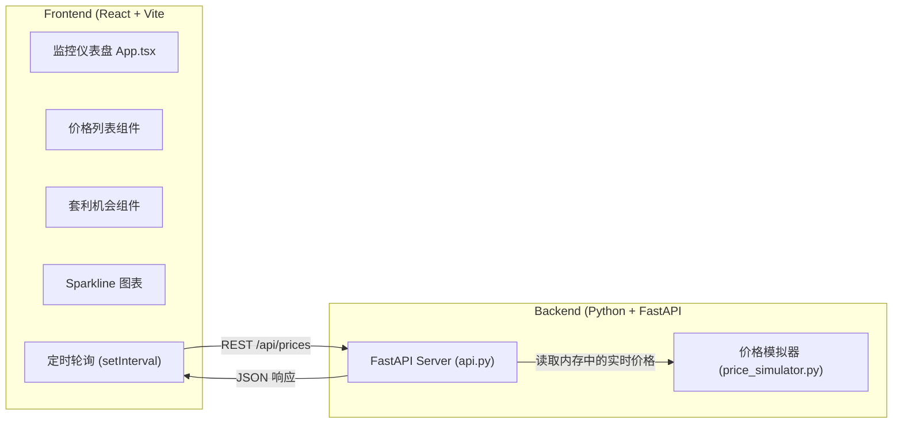
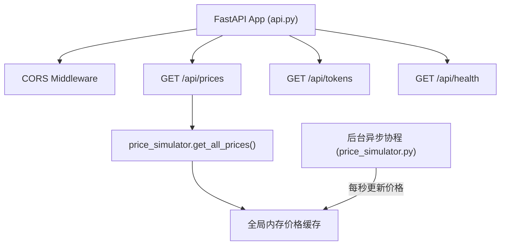
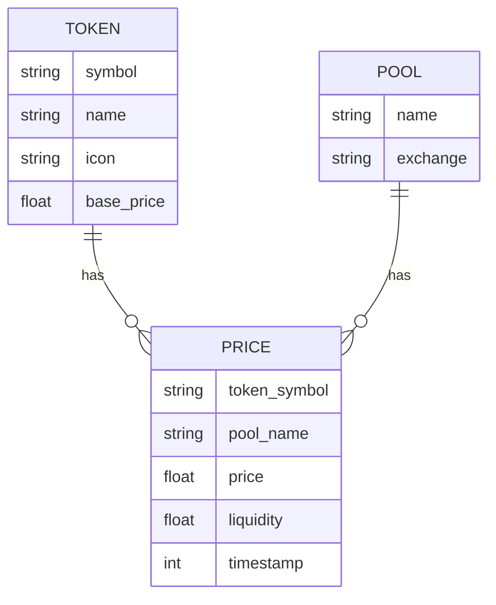

## 1. 架构设计



## 2. 技术说明

- **前端**：React@18 + TypeScript + Vite@5 + tailwindcss@3
- **样式**：Tailwind CSS 3，自定义霓虹主题
- **图表**：recharts（Sparkline 迷你走势图）
- **HTTP**：原生 fetch API 轮询
- **后端**：Python 3.10 + FastAPI@0.109
- **后端模拟**：异步协程 + asyncio 定时波动模拟实时价格
- **CORS**：FastAPI CORS middleware 允许跨域
- **数据存储**：内存全局变量（无需数据库）

## 3. 路由定义

| 路由 | 用途 |
|-------|---------|
| / | 前端监控仪表盘 |
| /api/prices | 获取所有代币在各 DEX 池的实时价格 |
| /api/tokens | 获取支持的代币列表 |
| /api/health | 健康检查端点 |

## 4. API 定义

### GET /api/prices 响应
```typescript
interface TokenPrice {
  symbol: string;
  name: string;
  icon: string;
  pools: PoolPrice[];
  change24h: number;
  priceHistory: number[];
}

interface PoolPrice {
  pool: string;
  exchange: string;
  price: number;
  liquidity: number;
}

interface PricesResponse {
  timestamp: number;
  tokens: TokenPrice[];
}
```

### 套利机会检测逻辑（前端计算）：
```typescript
interface ArbitrageOpportunity {
  token: string;
  buyPool: string;
  sellPool: string;
  buyPrice: number;
  sellPrice: number;
  spreadPercent: number;
  estimatedProfit: number;
  timestamp: number;
}
```

## 5. 后端服务架构



## 6. 数据模型

### 6.1 数据模型定义



### 6.2 模拟代币列表（内置数据）
| symbol | name | base_price |
|--------|------|------------|
| SOL | Solana | 165.50 |
| USDC | USD Coin | 1.00 |
| BONK | Bonk | 0.000025 |
| JTO | Jito | 2.85 |
| WIF | Dogwifhat | 2.45 |
| JUP | Jupiter | 0.78 |
| RAY | Raydium | 0.95 |
| MEW | Cat in a Dogs World | 0.0068 |

### DEX 池
| pool | exchange |
|------|----------|
| Raydium | Raydium |
| Orca | Orca |
| Jupiter | Jupiter Aggregator |
| Meteora | Meteora |
